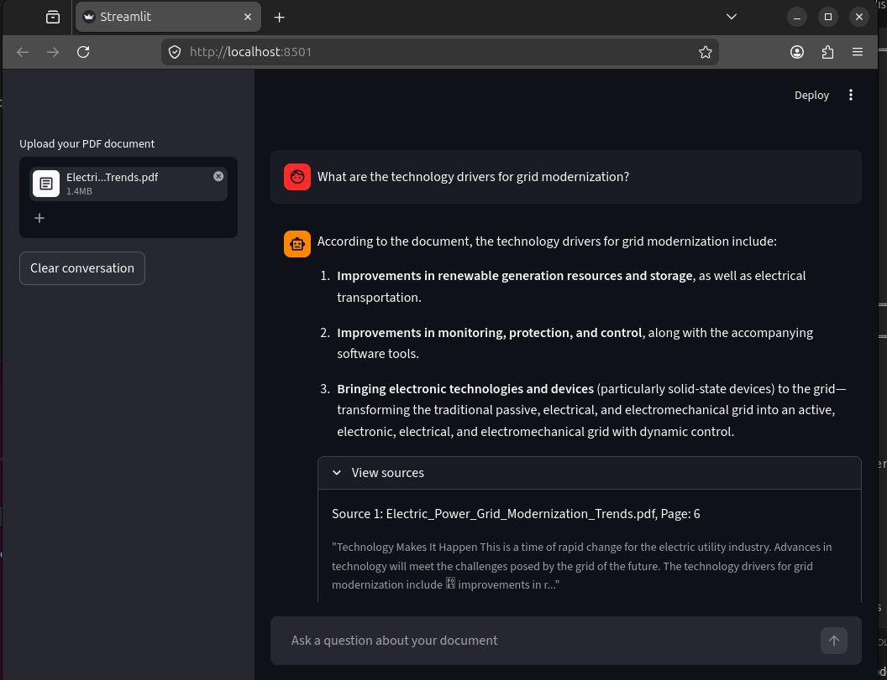

# PDF Chat Assistant

A production-grade **RAG (Retrieval-Augmented Generation)** application that allows you to have intelligent, grounded conversations with your PDF documents. Built with **LangChain**, **ChromaDB**, and **Claude API (Anthropic)**.

---

## ✨ Features

- **Local Embedding Processing**: Uses `all-MiniLM-L6-v2` to process vectors locally on your CPU—no data leaves your machine until the final LLM prompt.
- **State-of-the-Art Reasoning**: Powered by **Claude 4.7**, providing high-accuracy answers based strictly on your context.
- **Persistent Storage**: ChromaDB integration ensures that once a PDF is indexed, it stays indexed across sessions.
- **Source Attribution**: Every answer includes a "View Sources" dropdown, showing you the exact page numbers and text snippets used to generate the response.
- **Dockerized**: Fully containerized for easy deployment and consistent environments.

---

## 📸 Demo

---

## 🛠️ Project Structure

```text
.
├── src/
│   ├── ingestion/      # PDF Loading and Text Splitting
│   ├── retrieval/      # Embeddings and Vector Store logic
│   ├── generation/     # LLM factory and Prompt templates
│   └── services/       # RAG Pipeline orchestration
|
├── tests/              # Pytest suite
├── app.py              # Streamlit Entry Point
├── Dockerfile          # Container configuration
└── .env.example        # Template for secrets
```
---

## 🏗️ Architecture
 
The application is split into two distinct phases — **Ingestion** (run once per PDF) and **Querying** (run on every user question).
 
```text
╔══════════════════════════════ INGESTION PIPELINE ═══════════════════════════╗
║                                                                             ║
║   📄 PDF File                                                               ║
║       │                                                                     ║
║       ▼                                                                     ║
║   [ PdfReader  ]        pypdf.PdfReader extracts raw text page by page      ║
║       │                                                                     ║
║       ▼                                                                     ║
║   [ Text Chunker ]      RecursiveCharacterTextSplitter slices text into     ║
║       │                 overlapping chunks (CHUNK_SIZE / CHUNK_OVERLAP)     ║
║       ▼                                                                     ║
║   [ Embedder ]          all-MiniLM-L6-v2 converts each chunk into a         ║
║       │                 384-dim vector — runs locally on CPU                ║
║       ▼                                                                     ║
║   [ ChromaDB ]          Vectors + metadata stored persistently on disk      ║
║                                                                             ║
╚═════════════════════════════════════════════════════════════════════════════╝
 
╔══════════════════════════════ QUERY PIPELINE ═══════════════════════════════╗
║                                                                             ║
║   💬 User Question                                                          ║
║       │                                                                     ║
║       ▼                                                                     ║
║   [ Embedder ]          Same model encodes the question into a vector       ║
║       │                                                                     ║
║       ▼                                                                     ║
║   [ ChromaDB Retriever ] Top-K most similar chunks fetched by cosine        ║
║       │                  similarity (default: TOP_K_RESULTS=4)              ║
║       ▼                                                                     ║
║   [ Prompt Builder ]    Question + retrieved chunks assembled into a        ║
║       │                 grounded prompt with strict context instructions    ║
║       ▼                                                                     ║
║   [ Claude 4.7 ]        LLM generates an answer — strictly from context     ║
║       │                                                                     ║
║       ▼                                                                     ║
║   💡 Answer + Sources   Response shown with page-level source attribution   ║
║                                                                             ║
╚═════════════════════════════════════════════════════════════════════════════╝
```
 
> **Why two phases?** Ingestion is expensive (I/O + embedding) but only runs once. Querying is fast because retrieval and generation are the only steps at runtime.
 
---

## 🚀 Quick Start

### 1. Prerequisites

- Python 3.12+
- An Anthropic API Key

### 2. Installation

```bash
# Clone the repository
git clone https://github.com/aysa-dev1/chat_with_your_documents.git
cd chat_with_your_documents

# Create a virtual environment
python -m venv venv
source venv/bin/activate  # On Windows: venv\Scripts\activate

# Install dependencies
pip install -r requirements.txt
```

### 3. Environment Setup

Copy `.env.example` to `.env` in the root directory and fill in your values:

```env
ANTHROPIC_API_KEY=your_sk_key_here
ANTHROPIC_MODEL=claude-opus-4-7
MAX_TOKENS=1024
CHUNK_SIZE=1000
CHUNK_OVERLAP=200
CHROMA_PERSIST_DIR=./data/chroma
TOP_K_RESULTS=4
```

### 4. Run the App

```bash
streamlit run app.py
```

---

## 🐳 Docker Deployment

If you prefer to run with Docker:

```bash
# Build the image
docker build -t chat-with-documents .

# Run the container
docker run -p 8501:8501 --env-file .env chat-with-documents
```

---

## 🧪 Testing

The project includes a robust test suite covering ingestion logic, prompt construction, and the RAG pipeline orchestration using `pytest` and `pytest-mock`.

```bash
pytest tests/
```

---

## 🛡️ Key Guardrails

- **No Hallucinations**: The system message explicitly instructs the LLM to only answer based on the provided PDF context.
- **Secure Secrets**: The `.dockerignore` and `.gitignore` files ensure your `.env` file is never leaked or baked into images.
- **Performance Optimization**: Streamlit's `@st.cache_resource` is used to prevent redundant loading of heavy ML models and database connections.

---

## 📄 License

Distributed under the MIT License.
